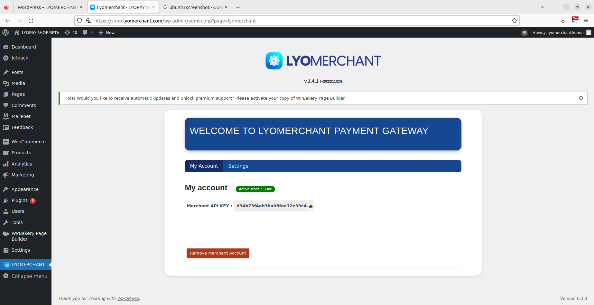
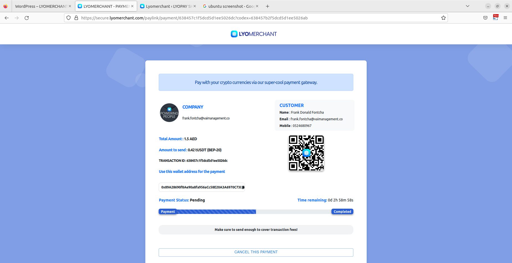

# Introduction

LYOMERCHANT is the best service that allows everyone to accept crypto payments on their websites, online stores, and social media accounts. It’s a non-custodial service, meaning it doesn’t hold or store your funds in any way. LYOMERCHANT supports more than 50 cryptocurrencies, and it offers low transaction fees.

LYOMERCHANT was founded in 2019, by the team behind LYOTRADE, a cryptocurrency exchange service. Our mission is to provide a crypto payment gateway that is easy to use and embed into existing websites. We believe everyone should have the chance to accept crypto payments or crypto donations for their e-commerce stores, charities or any type of business.

We provide a simple, easy-to-integrate service, and the only step needed to accept crypto payments is to copy a chunk of HTML code. Transactions are tied to your LYOMERCHANT account and the API key you use for a specific purpose. We offer flexible solutions, like accepting payments in many different coins or converting all crypto assets you receive into your favorite cryptocurrency! The automatic exchange is powered by our crypto exchange service, LYOTRADE.

## Integration

Integrate our system in 3 easy steps.

1. Choose one mode and Register a merchant account.
2. Get your API key
3. Integrate with your business, disrupt and innovate!

## Create Merchant Account
Merchant Registration LINK  for Live version : <a href="https://dashboard.portal.lyomerchant.com/register" target="_blank">https://dashboard.portal.lyomerchant.com/register</a>

Merchant Registration LINK  for Sandbox version : <a href="https://sandbox.portal.lyomerchant.com/register" target="_blank">https://sandbox.portal.lyomerchant.com/register</a>

## Get your API key

- Access your dashboard account and get your APIKEY in > Settings
- Enable system access that you want to use


# HOSTED PAYMENT LINK

## Hosted Payment Link

This endpoint should be used in server side to secure your apikey

for Sandbox text use your Sandbox APIKEY

```javascript

import axios from "axios";

var config = {
        method: 'POST',
        url: "https://secure.lyomerchant.com/api/v1/createPayment",
        data: {
              invoiceNumber: '0001',
              customerName: "test user",
              mobileNumber: "+97156565656", 
              email: "test@email.com", 
              orderId: "your order id",
              totalAmount: 250, 
              currency: "AED", 
              duedate: "12/09/2022",
              token: "your unique token",
              items: [
                {
                  'number': 1,
                  'itemName': 'some text',
                  'itemDesc': 'some text',
                  'quantity': '1',
                  'amount': '200',
                  'rate': '3',
                  'tax': "0.5",
                }
              ],
              additionalNotes: "some text",
              payment_reason: "Payment for checkout product",
              successURL: "https://example.com/thankyou",
              errorURL: "https://example.com/error"
        }
        headers: {
            'Content-Type': 'application/x-www-form-urlencoded',
            'apikey': "8482832asaxxxxxxxxxxx",
            'appMode': "Sandbox" // Sandbox | Live
        },
};
return axios(config)
```

```php

$data = [
    'invoiceNumber' => 0001,
    'customerName' => "test user",
    'mobileNumber' => "+97156565656",
    'email' => 'test@email.com',
    'totalAmount' => 250,
    'currency' => "AED",
    'duedate' => "12/09/2022",
    'items' => null | array,
    'orderId' => "your order id",
    'token' => "your unique token",
    'additionalNotes' => "some text",
    'payment_reason' => "Payment for checkout product",
    'successURL' => "https://example.com/thankyou",
    'errorURL' => "https://example.com/error",
];

$curl = curl_init();
$url = "https://secure.lyomerchant.com/api/v1/createPayment";
curl_setopt($curl, CURLOPT_POST, TRUE);

$data = http_build_query($data);

curl_setopt($curl, CURLOPT_URL, $url);
curl_setopt($curl, CURLOPT_HTTPHEADER, array(
    'Content-Type: application/x-www-form-urlencoded',
    'apikey: 8482832asaxxxxxxxxxxx',
    'appMode: Sandbox' // Sandbox | Live
));
curl_setopt($curl, CURLOPT_SSL_VERIFYHOST, true);
curl_setopt($curl, CURLOPT_SSL_VERIFYPEER, 1);
curl_setopt($curl, CURLOPT_POSTFIELDS, $data);
curl_setopt($curl, CURLOPT_RETURNTRANSFER, true);

$result = curl_exec($curl);

$result = (array) json_decode($result, true);
```

```shell
curl -X 'POST' \
  'https://secure.lyomerchant.com/api/v1/createPayment' \
  -H 'accept: application/json' \
  -H 'Content-Type: application/x-www-form-urlencoded'
```

### Path Parameters

| Parameter | type  | Required  | Description |
|-----------|-------| ----------- | ----------- |
| invoiceNumber    |	String |	Yes |	A unique string that identifies you invoice |
| customerName    |	String |	Yes |	The customer name |
| mobileNumber    |	String |	No |	The customer mobile number |
| email    |	String |	No |	The customer email address. |
| totalAmount    |	float |	Yes |	The total amount to pay |
| currency    |	String |	Yes |	Default checkout currency. |
| duedate    |	Date |	no |	the invoice expiration date. |
| items    |	array |	no |	the list of checkout items. |
| additionalNotes    |	String |	no |	The full description. |
| payment_reason    |	String |	Yes |	The short description. |
| successURL    |	String |	Yes |	The redirection link in case of successfull payment |
| errorURL    |	String |	Yes |	The redirection link in case of error or cancelation. |
| apikey    |	String |	Yes |	A unique string that identifies the merchant. |
| appMode    |	String |	Yes |	A unique string that define the mode you want to use. default is Sandbox |


This endpoint returns the payment link that will be used for online payment with LYOMERCHANT Gateway 

The generated link is valid for 10 minutes

> The above commands returns JSON structured like this:

```json
    {
       "status": 200,
       "mssg": "ok",
       "data": {
          "link": "https://secure.lyomerchant.com/paylink/631887d9af531bdbc3b5ab33"
        }
    }
```
### Response schema
A successful request will return the following JSON response and properties:

| Property          |  Type   |  Description     |
|-------------------|---------| -------------------------------- |
| status             |  int |  The status for the request 200 if succeded and 400 if error occured|
| mssg           |  String |  The message from the server|
| link           |  String |  The link to use for the payment|

# API

Our cryptocurrency API offers instant payment notifications (IPN), and it simplifies customized integration of our crypto payment service into your website, platform, or mobile app. 


## Get all supported network

This endpoint should be used in server side to secure your apikey


```javascript
var config = {
        method: 'POST',
        url: "https://secure.lyomerchant.com/api/plugins/v1/networks",
        data: {}
        headers: {
            'Content-Type': 'application/x-www-form-urlencoded',
            'apikey': "8482832asaxxxxxxxxxxx",
            'appMode': "Sandbox" // Sandbox | Live
        },
};
return axios(config)
```

```php

$data = []

$curl = curl_init();
$url = "https://secure.lyomerchant.com/api/plugins/v1/networks";
curl_setopt($curl, CURLOPT_POST, TRUE);

curl_setopt($curl, CURLOPT_URL, $url);
curl_setopt($curl, CURLOPT_HTTPHEADER, array(
    'Content-Type: application/x-www-form-urlencoded',
    'apikey: 8482832asaxxxxxxxxxxx',
    'appMode: Sandbox' // Sandbox | Live
));
$data = http_build_query($data);
curl_setopt($curl, CURLOPT_SSL_VERIFYHOST, true);
curl_setopt($curl, CURLOPT_SSL_VERIFYPEER, 1);
curl_setopt($curl, CURLOPT_POSTFIELDS, $data);
curl_setopt($curl, CURLOPT_RETURNTRANSFER, true);

$result = curl_exec($curl);

$result = (array) json_decode($result, true);
```

```shell
curl -X 'POST' \
  'https://secure.lyomerchant.com/api/plugins/v1/networks' \
  -H 'accept: application/json' \
  -H 'Content-Type: application/x-www-form-urlencoded'
```

This endpoint returns the list of the networks that can be used for online payment with LYOMERCHANT  

> The above commands returns JSON structured like this:

```json
  {
        "status": 200,
        "message": "get",
        "data": [
          {
            "_id": "63419afef205a3789b787612",
            "networkDetails": [
                {
                    "id": "62f53075cd93216e17a2b1b4",
                    "network": "TRC20",
                    "coin": "USDT",
                    "cointype": "Token",
                    "libarayType": "Tronweb",
                    "currencyid": "tether",
                    "icon": "https://changenow.io/images/sprite/currencies/trx.svg"
                }
            ]
          },
        ]
  }
```
### Response schema
A successful request will return the following JSON response and properties:

| Property          |  Type   |  Description     |
|-------------------|---------| -------------------------------- |
| status             |  int |  The status for the request 200 if succeded and 400 if error occured|
| message           |  String |  The message from the server|
| id           |  String |  Network unique ID|
| coin |  String |  the coin short name|
| network | String | the network name |
| cointype |  String |  the coin type Native or Token|
| currencyId |  string |  the network id in the market|


## Get all allowed Fiat Currency

This endpoint should be used in server side to secure your apikey


```javascript
var config = {
        method: 'POST',
        url: "https://secure.lyomerchant.com/api/v1/getAllCurrency",
        data: {}
        headers: {
            'Content-Type': 'application/x-www-form-urlencoded',
            'apikey': "8482832asaxxxxxxxxxxx",
            'appMode': "Sandbox" // Sandbox | Live
        },
};
return axios(config)
```

```php

$data = []

$curl = curl_init();
$url = "https://secure.lyomerchant.com/api/v1/getAllCurrency";
curl_setopt($curl, CURLOPT_POST, TRUE);

curl_setopt($curl, CURLOPT_URL, $url);
curl_setopt($curl, CURLOPT_HTTPHEADER, array(
    'Content-Type: application/x-www-form-urlencoded',
    'apikey: 8482832asaxxxxxxxxxxx',
    'appMode: Sandbox' // Sandbox | Live
));
$data = http_build_query($data);
curl_setopt($curl, CURLOPT_SSL_VERIFYHOST, true);
curl_setopt($curl, CURLOPT_SSL_VERIFYPEER, 1);
curl_setopt($curl, CURLOPT_POSTFIELDS, $data);
curl_setopt($curl, CURLOPT_RETURNTRANSFER, true);

$result = curl_exec($curl);

$result = (array) json_decode($result, true);
```

```shell
curl -X 'POST' \
  'https://secure.lyomerchant.com/api/v1/getAllCurrency' \
  -H 'accept: application/json' \
  -H 'Content-Type: application/x-www-form-urlencoded'
```

This endpoint returns the list of the currencies that can be used for online payment with LYOMERCHANT  

> The above commands returns JSON structured like this:

```json
  {
        "status": 200,
        "message": "get",
        "data": [
          {
            "_id": "6308805b497bd75f9d13c398",
            "id": "6308805b497bd75f9d13c397",
            "title": "AED",
            "status": 1,
            "remarks": "asdas",
            "created_by": "1",
            "deleted_by": "0",
            "deleted_at": "0",
            "createdAt": "2022-08-26T08:12:11.517Z",
            "updatedAt": "2022-08-26T12:01:03.928Z",
            "__v": 0,
            "icon": "https://cdn-icons-png.flaticon.com/512/323/323301.png",
            "name": "Dirham"
          },
        ]
  }
```
### Response schema
A successful request will return the following JSON response and properties:

| Property          |  Type   |  Description     |
|-------------------|---------| -------------------------------- |
| status             |  int |  The status for the request 200 if succeded and 400 if error occured|
| message           |  String |  The message from the server|
| id           |  String |  Currency unique ID|
| title |  String |  the currency short name|
| name | String | the currency full name |
| icon |  String |  the currency flag|
| status |  int |  the currency status 1 if it's active and 0 if it's inactive|


## Convert the checkout price in Crypto Price

```javascript

import axios from "axios";

var networkID = "network unique ID available in all Network response"
var currencyID = "currency unique ID available in all Network response"

var config = {
        method: 'POST',
        url: "https://secure.lyomerchant.com/api/plugins/v1/convertToNetwork",
        data: {
            coinid: networkID,
            currenid: currencyID
        },
        headers: {
            'Content-Type': 'application/x-www-form-urlencoded',
            'apikey': "8482832asaxxxxxxxxxxx",
            'appMode': "Sandbox" // Sandbox | Live
        }
};
return axios(config)
```

```php

$networkID = "network unique ID available in all Network response";
$currencyID = "currency unique ID available in all Network response";

$data = [
  'coinid' => $networkID,
  'currenid' => $currencyID
]

$curl = curl_init();
$url = "https://secure.lyomerchant.com/api/plugins/v1/convertToNetwork";
curl_setopt($curl, CURLOPT_POST, TRUE);

curl_setopt($curl, CURLOPT_URL, $url);
curl_setopt($curl, CURLOPT_HTTPHEADER, array(
    'Content-Type: application/x-www-form-urlencoded',
    'apikey : 8482832asaxxxxxxxxxxx',
    'appMode : Sandbox' // Sandbox | Live
));
$data = http_build_query($data);
curl_setopt($curl, CURLOPT_SSL_VERIFYHOST, true);
curl_setopt($curl, CURLOPT_SSL_VERIFYPEER, 1);
curl_setopt($curl, CURLOPT_POSTFIELDS, $data);
curl_setopt($curl, CURLOPT_RETURNTRANSFER, true);

$result = curl_exec($curl);

$result = (array) json_decode($result, true);
```

```shell
curl -X 'POST' \
  'https://secure.lyomerchant.com/api/plugins/v1/convertToNetwork' \
  -H 'accept: application/json' \
  -H 'Content-Type: application/x-www-form-urlencoded'
```

This endpoint returns the coin price on the market in USD 

> The above commands returns JSON structured like this:

```json
  {
    "lyocredit": {
        "usd": 1.38
    }
  }

  CryptoPrice = response.lyocredit.usd
```
> Use the amount in the response to calculate the price:

```json
  AmountToPay = Checkout_Amount / CryptoPrice
```

### Response schema
A successful request will return the following JSON response and properties:

| Property          |  Type   |  Description     |
|-------------------|---------| -------------------------------- |
| usd             |  float |  The usd price for the coin in the market|


## Convert price in USD

```javascript

import axios from "axios";

var amount = "18"
var currency = "AED"

var config = {
        method: 'POST',
        url: "https://secure.lyomerchant.com/api/plugins/v1/convertToUSD",
        data: {
          from: currency,
          amount: amount
        },
        headers: {
           'Content-Type': 'application/x-www-form-urlencoded',
           'apikey': "8482832asaxxxxxxxxxxx",
           'appMode': "Sandbox" // Sandbox | Live
        },
        
};
return axios(config)
```

```php
$data = [
  'amount' => "18"
  'from' => "AED"
]

$curl = curl_init();
$url = "https://secure.lyomerchant.com/api/plugins/v1/convertToUSD";
curl_setopt($curl, CURLOPT_POST, TRUE);

curl_setopt($curl, CURLOPT_URL, $url);
curl_setopt($curl, CURLOPT_HTTPHEADER, array(
    'Content-Type: application/x-www-form-urlencoded',
    'apikey: 8482832asaxxxxxxxxxxx',
    'appMode: Sandbox' // Sandbox | Live
));
$data = http_build_query($data);
curl_setopt($curl, CURLOPT_SSL_VERIFYHOST, true);
curl_setopt($curl, CURLOPT_SSL_VERIFYPEER, 1);
curl_setopt($curl, CURLOPT_POSTFIELDS, $data);
curl_setopt($curl, CURLOPT_RETURNTRANSFER, true);

$result = curl_exec($curl);

$result = (array) json_decode($result, true);
```

```shell
curl -X 'POST' \
  'https://secure.lyomerchant.com/api/plugins/v1/convertToUSD' \
  -H 'accept: application/json' \
  -H 'Content-Type: application/x-www-form-urlencoded'
```

This endpoint returns the USD price according to your default currency

> The above commands returns JSON structured like this:

```json
  {
    "success": true,
    "query": {
        "from": "AED",
        "to": "USD",
        "amount": 18
    },
    "info": {
        "timestamp": 1662555604,
        "rate": 0.272254
    },
    "date": "2022-09-07",
    "result": 4.900572
 }
```
### Response schema
A successful request will return the following JSON response and properties:

| Property          |  Type   |  Description     |
|-------------------|---------| -------------------------------- |
| result             |  float |  The USD price after convertion|
| date             |  date |  The current convertion date|


## Assign Merchant Wallet

```javascript

import axios from "axios";

var qs = require('qs');

var orderid = "your order id"
var networkType = network_id
var token = "your order token"
var currency = "AED"
var callbackurl = your_callback_url
var apiredirecturl = "app redirection link for success"
var errorurl = "app redirection link for error"
var amount = "crypto_amount"

var config = {
        method: 'POST',
        url: "https://secure.lyomerchant.com/api/plugins/v1/assignWalletAddress",
        data: qs.stringify({
          orderid : "your order id",
          networkType : networkType,
          callbackurl : 'your_callback_url',
          apiredirecturl : "app redirection link for success",
          errorurl : "app redirection link for error",
          token : "your order token",
          currency : "AED",
          amount : "crypto_amount",
        }),
        headers: {
            'Content-Type': 'application/x-www-form-urlencoded',
            'apikey': "8482832asaxxxxxxxxxxx",
            'appMode': "Sandbox" // Sandbox | Live
        },
};
return axios(config)
```

```php

$orderid = "your order id";
$networkType = $network_id;
$callbackURL = 'your_callback_url';
$apiredirecturl = "app redirection link for success";
$errorurl = "app redirection link for error";
$token = "your order token";
$currency = "AED";
$amount = "crypto_amount";

$data = [
  'orderid' => "your order id",
  'networkType' => $networkType,
  'callbackURL' => 'your_callback_url',
  'apiredirecturl' = "app redirection link for success";
  'errorurl' = "app redirection link for error";
  'token' => "your order token",
  'currency' => "AED",
  'amount' => "crypto_amount",
];

$curl = curl_init();
$url = "https://secure.lyomerchant.com/api/plugins/v1/assignWalletAddress";
curl_setopt($curl, CURLOPT_POST, TRUE);

$data = http_build_query($data);

curl_setopt($curl, CURLOPT_URL, $url);
curl_setopt($curl, CURLOPT_HTTPHEADER, array(
    'Content-Type: application/x-www-form-urlencoded',
    'apikey: 8482832asaxxxxxxxxxxx',
    'appMode: Sandbox' // Sandbox | Live
));
curl_setopt($curl, CURLOPT_SSL_VERIFYHOST, true);
curl_setopt($curl, CURLOPT_SSL_VERIFYPEER, 1);
curl_setopt($curl, CURLOPT_POSTFIELDS, $data);
curl_setopt($curl, CURLOPT_RETURNTRANSFER, true);

$result = curl_exec($curl);

$result = (array) json_decode($result, true);
```

```shell
curl -X 'POST' \
  'https://secure.lyomerchant.com/api/plugins/v1/assignMerchantWallet' \
  -H 'accept: application/json' \
  -H 'Content-Type: application/x-www-form-urlencoded' \
  -d '{
        "orderid" : "your order id",
        "networkType" : '{{networkType}}',
        "callbackURL" : "your_callback_url",
        "token" : "your order token",
        "currency" : "AED",
        "amount" : "crypto_amount",
   }'
```

Call this request to get wallet for deposit and transaction validity

### Path Parameters

| Parameter | type  | Required  | Description |
|-----------|-------| ----------- | ----------- |
| orderid    |	String |	Yes |	A unique string that identifies you order |
| apiredirecturl    |	String |	no| |
| networkType    |	String |	Yes |	the network id used for the payment. |
| callbackURL    |	String |	No |	the link where the confirmation IPN will be sent. |
| token    |	String |	Yes |	A unique string that identifies you client |
| currency    |	String |	Yes |	A string that identifies the currency used. |
| amount    |	String |	Yes |	the amount to pay. |
| errorurl    |	String |	no | |

> The above commands returns JSON structured like this:

```json
  {
    "status": 200,
    "message": "Assigned Merchant Wallet Successfully",
    "data": {
        "transactionID": "xxxxxxxxxxxxxxxxxxxx",
        "address": "0xdA2E0xxxxxxxxxxxxxxxxxxxxxx",
        "walletValidity": "1660202357"
    }
  }
```
### Response schema
A successful request will return the following JSON response and properties:

| Property          |  Type   |  Description     |
|-------------------|---------| -------------------------------- |
| status             |  int |  The status for the request 200 if succeded and 400 if error occured|
| message           |  String |  The message from the server|
| transactionID           |  String |  payment transaction ID|
| address |  String |  Wallet address asign for the deposit|
| walletValidity |  String |  Transaction validity (3hours)|


## Check Transaction Status

```javascript

import axios from "axios";

var md5 = require('md5');
var qs = require('qs');

var orderid = "your order id"
var transid = "your transaction id"

var config = {
        method: 'POST',
        url: "https://secure.lyomerchant.com/api/plugins/v1/transactionStatus",
        data: qs.stringify({
          orderid : orderid,
          transid : transid
        }),
        headers: {
            'Content-Type': 'application/x-www-form-urlencoded',
            'apikey': "8482832asaxxxxxxxxxxx",
            'appMode': "Sandbox" // Sandbox | Live
        },
};
return axios(config)
```

```php

$orderid = "your order id";
$transid = "your transaction id";

$data = [
  'orderid' => $orderid,
  'transid' => $transid
];

$curl = curl_init();
$url = "https://secure.lyomerchant.com/api/plugins/v1/transactionStatus";
curl_setopt($curl, CURLOPT_POST, TRUE);

$data = http_build_query($data);

curl_setopt($curl, CURLOPT_URL, $url);
curl_setopt($curl, CURLOPT_HTTPHEADER, array(
    'Content-Type: application/x-www-form-urlencoded',
    'apikey: 8482832asaxxxxxxxxxxx',
    'appMode: Sandbox' // Sandbox | Live
));
curl_setopt($curl, CURLOPT_SSL_VERIFYHOST, true);
curl_setopt($curl, CURLOPT_SSL_VERIFYPEER, 1);
curl_setopt($curl, CURLOPT_POSTFIELDS, $data);
curl_setopt($curl, CURLOPT_RETURNTRANSFER, true);

$result = curl_exec($curl);

$result = (array) json_decode($result, true);
```

```shell
curl -X 'POST' \
  'https://secure.lyomerchant.com/api/plugins/v1/transactionStatus' \
  -H 'accept: application/json' \
  -H 'Content-Type: application/x-www-form-urlencoded' \
  -d '{
        "orderid" : "your order id",
        "transid" : "your transaction id"
   }'
```

Call this request to get the transaction current status

### Path Parameters

| Parameter | type  | Required  | Description |
|-----------|-------| ----------- | ----------- |
| orderid    |	String |	Yes |	A unique string that identifies you order |
| transid    |	String |	Yes |	A unique string that identifies the transaction. |
| appMode    |	String |	Yes |	A unique string that define the mode you want to use. default is Sandbox |

> The above commands returns JSON structured like this:

```json
  {
    "status": 200,
    "data": {
        "transaction_id": "xxxxxxxxxxxxxxxxxxxx",
        "invoicenumber": "xxxxxxxxxxxxxxx",
        "transaction_status": "Completed",
        "address": "0x61546feeffxxxxxxxxxxxx4424B",
        "coin": "tUSDT",
        "network": "BEP-20",
        "crypto_amount": 2,
        "invoicenumber": "",
        "fiat_amount": "",
        "currency": 0
    }
  }
```
### Response schema
A successful request will return the following JSON response and properties:

| Property          |  Type   |  Description     |
|-------------------|---------| -------------------------------- |
| status             |  int |  The status for the request 200 if succeded and 400 if error occured|
| message           |  String |  The message from the server|
| transaction_id           |  String |  payment transaction ID|
| transaction_status |  String |  Transaction current status ("Cancelled", "Pending", "Completed", "Expired", "Partial")|


## Realtime status


Call this request to get realtime transaction status through the socket


```javascript

   var md5 = require('md5');
  
   let hash = md5(transactionID + apikey + "_LYO")

   let websocketurl = 'wss://sandbox.api.lyomerchant.com:5010?transkey=' + transactionID + '&apikey=' + apikey + '&hash=' + hash

   // use this endpoint for the LIve : wss://staging.api.lyomerchant.com:5010

   if (window.WebSocket) {
        socket = new WebSocket(websocketurl);
        socket.onopen = function (data) {
            console.log("Socket Initiate")
        };

        socket.onmessage = function (message) {
            let data = JSON.parse(message.data)

            console.log("message", JSON.parse(message.data))
            
            let status = data.amountstatus
        };
    }

```

## CallbackURL Process

The callback URL will be call by the server


> The callbackUrl returns JSON structured like this:

```json
  {
    "transcationDetails" : {
        "orderid": "xxxxxxxxxxxxxx",
        "clientToken": "your_order_token",
        "amountstatus": "transaction status",
        "transcationlogsDetails": {
            "transactionHistory": [],
            "remainbalance": 0,
        }
    }
 }
```
### Response schema
A successful request will return the following JSON response and properties:

| Property          |  Type   |  Description     |
|-------------------|---------| -------------------------------- |
| amountstatus             |  int |  The status for the transaction  0 = Pending, 1 = Completed, 2 = Partial, 3 = Over Limited|
| orderid           |  String |  The order ID send on  Assign Merchant Wallet
| clientToken           |  String |  The unique client identification send on  Assign Merchant Wallet|
| remainbalance |  float |  the remaining balance on partial payment|
| transactionHistory |  String |  the transaction history on partial payment|


# Plugins

Our crypto payment gateway can easily integrate into major CMS solutions like WooCommerce, Magento 2, Zencart, OpenCart, and WHMCS. If you own an online store and want to enable payments in cryptocurrency, simply install one of our plugins! We provide detailed installation instructions and support if you encounter any difficulties!

## WordPress

### Releases

 - v.1.0 (Jul 4, 2022)

 Lyomerchant plugin first push

 Accept crypto currencies payment in your WooCommerce Website using the payment widget

 - v.1.1 (Aug 2, 2022)

 Widget payment updated - Sandbox websocket added - bugs fixed

 - v.1.2 (Oct 12, 2022)

 Bugs fixed with socket link - hosted payment link added - update admin setings page

 - v.1.3

 Shortode layout Updated - update plugin link in WooCommerce Settings - update admin settings layout

 - v.1.4 (Nov 23, 2022 ~ latest)

 Allowed fiat currencies added - price calculation updated - transactions status checking added before order status update
 Partial payment status added in shortcode

### Download & Install

follow this <a href="https://drive.google.com/file/d/1Q5BKwnf_TMiJogJXrT63SOxYEsG0BLbR/view" target="_blank">link to download</a> the latest version of the LYOMERCHANT plugin for WooCommerce


### Verify your merchant account

Access to the plugin page : FInd LYOMERCHANT in the left menu.


Enter your merchant registered email and submit



### Enable networks for widget mode

Choose your prefered network that will be displayed to the customers, your theme and save the settings


### Enable the plugin in woocommerce

Go to the WooCommerce Settings page, select Payments, <b>enable</b> LYOMERCHANT Gateway and save the settings


### Start accepting payment with LYOMERCHANT

Your website is ready to accept crypto payment with LYOMERCHANT


Payment proccess screen with QrCode and wallet address for the widget mode


Payment proccess screen with QrCode and wallet address for the Payment Link mode



## Magento 2

### Releases

 - v.1.0 (Sep 22, 2022 ~ latest v1.0)

 Lyomerchant plugin first push
 Widget payment screen added - added into magento payment options 
 Update payment settings add allowed fiat currencies
 Update price conversion
 Update transactions status checking before updating order status

### Download & Install

follow this <a href="https://drive.google.com/file/d/1QJXXeCcVQkezY3SDUBPYIjIfurMyqDnI/view" target="_blank">link to download</a> the latest version of the LYOMERCHANT plugin for magento2

### How to Install

Extract the downloaded file in your Magento2 project in the folder: 

- <b>app > code > Magento</b>


Open your terminal and navigate inside your magento2 project root folder then run the commands below

- php bin/magento setup:upgrade
- php bin/magento cache:flush
- php bin/magento setup:static-content:deploy -f

Access your Magento dashboard and check if Lyomerchant is available in your magento payment methods (the plugin is active by default)

### Setup the payment method

Open your magento dashboard, go to <b>STORES > Configuration > Sales > Payment Methods</b>
find Lyomerchant and setup your configuration (Recommended to keep default settings)


### Verify your merchant account

Open your magento dashboard, go to <b>STORES > Lyomerchant Settings</b>

- Enter your APIKEY for Live or Sandbox and choose the API MODE according to your APIKEY mode then save
- Choose your prefered networks for widget mode
- Make sure to used one of the allowed currencies


### Start accepting payment with LYOMERCHANT

Your website is ready to accept crypto payment with LYOMERCHANT


Payment proccess screen with QrCode and wallet address for the widget mode


Payment proccess screen with QrCode and wallet address for the Payment Link mode


## Shopify

Coming Soon.

## Zencart

Coming Soon.

## OpenCart

Coming Soon.

# Invoices

The invoice payment format allows people to pay in your online store in fewer steps, which simplifies their path and in the end, brings you more profits. Invoices incorporate all the payment info all in one place – making payments easier than ever!

# Billing and subscriptions in crypto

Request payments in  cryptocurrencies from your customers or B2B partners worldwide with recurring email billing. You can create several subscription groups by choosing different frequencies and different invoices for different subscription amounts.

# Custom Solutions

We take pride in being a heavily client-friendly service. If you don’t see anything that fits your needs but would still like to accept or send crypto payments, just hit us up and we’ll whip something up that suits your needs the most for you!

# Merchant Account KYC

Merchant KYC Verification LINK : <a target="_blank" href="https://dashboard.portal.lyomerchant.com/kyc/merchant/verification">https://dashboard.portal.lyomerchant.com/kyc/merchant/verification</a>