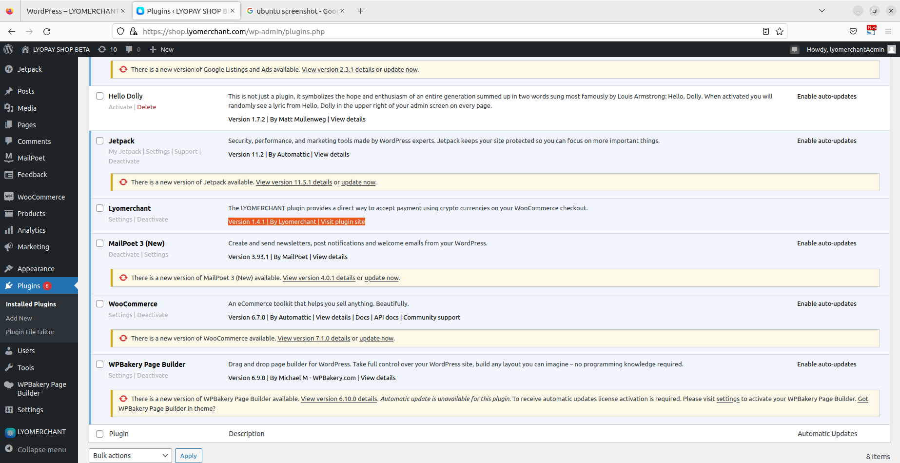

# Introduction

LYOMERCHANT is the best service that allows everyone to accept crypto payments on their websites, online stores, and social media accounts. It’s a non-custodial service, meaning it doesn’t hold or store your funds in any way. LYOMERCHANT supports more than 50 cryptocurrencies, and it offers low transaction fees.

LYOMERCHANT was founded in 2019, by the team behind LYOTRADE, a cryptocurrency exchange service. Our mission is to provide a crypto payment gateway that is easy to use and embed into existing websites. We believe everyone should have the chance to accept crypto payments or crypto donations for their e-commerce stores, charities or any type of business.

We provide a simple, easy-to-integrate service, and the only step needed to accept crypto payments is to copy a chunk of HTML code. Transactions are tied to your LYOMERCHANT account and the API key you use for a specific purpose. We offer flexible solutions, like accepting payments in many different coins or converting all crypto assets you receive into your favorite cryptocurrency! The automatic exchange is powered by our crypto exchange service, LYOTRADE.

## Integration

Integrate our system in 3 easy steps.

1. Choose one mode and Register a merchant account.
2. Get your API key
3. Integrate with your business, disrupt and innovate!

## Create Merchant Account
Merchant Registration LINK  for Live version : <a href="https://dashboard.portal.lyomerchant.com/register" target="_blank">https://dashboard.portal.lyomerchant.com/register</a>

Merchant Registration LINK  for Sandbox version : <a href="https://sandbox.portal.lyomerchant.com/register" target="_blank">https://sandbox.portal.lyomerchant.com/register</a>

## Get your API key

- Access your dashboard account and get your APIKEY in > Settings
- Enable system access that you want to use


# PAYMENT LINK

## Checkout Payment Link

This endpoint should be used in server side to hide you apikey visibility

```javascript

import axios from "axios";

var config = {
        method: 'POST',
        url: "https://link.sandbox.lyomerchant.com/api/v1/createPayment",
        data: {
              invoiceNumber: 0001,
              customerName: "test user",
              mobileNumber: "+97156565656", 
              email: "test@email.com", 
              totalAmount: 250, 
              currency: "AED", 
              duedate: "12/09/2022",
              additionalNotes: "some text", 
              raison: "Payment for checkout product",
              successURL: "https://example.com/thankyou",
              errorURL: "https://example.com/error",
              api_key: "Your merchant apikey",
              appMode: "Live" //Sandbox | Live
        }
        headers: {
            'Content-Type': 'application/x-www-form-urlencoded',
        },
};
return axios(config)
```

```php

$data = [
    'invoiceNumber' => 0001;
    'customerName' => "test user";
    'mobileNumber' => "+97156565656";
    'email' => 'test@email.com';
    'totalAmount' => 250;
    'currency' => "AED";
    'duedate' => "12/09/2022";
    'additionalNotes' => "some text";
    'raison' => "Payment for checkout product";
    'successURL' => "https://example.com/thankyou";
    'errorURL' => "https://example.com/error";
    'api_key' => "Your merchant apikey";
    'appMode' => "Live"; //Sandbox | Live
];

$curl = curl_init();
$url = "https://link.sandbox.lyomerchant.com/api/v1/createPayment";
curl_setopt($curl, CURLOPT_POST, TRUE);

$data = http_build_query($data);

curl_setopt($curl, CURLOPT_URL, $url);
curl_setopt($curl, CURLOPT_HTTPHEADER, array(
    'Content-Type: application/x-www-form-urlencoded'
));
curl_setopt($curl, CURLOPT_SSL_VERIFYHOST, true);
curl_setopt($curl, CURLOPT_SSL_VERIFYPEER, 1);
curl_setopt($curl, CURLOPT_POSTFIELDS, $data);
curl_setopt($curl, CURLOPT_RETURNTRANSFER, true);

$result = curl_exec($curl);

$result = (array) json_decode($result, true);
```

```shell
curl -X 'POST' \
  'https://link.sandbox.lyomerchant.com/api/v1/createPayment' \
  -H 'accept: application/json' \
  -H 'Content-Type: application/x-www-form-urlencoded'
```

### Path Parameters

| Parameter | type  | Required  | Description |
|-----------|-------| ----------- | ----------- |
| invoiceNumber    |	String |	Yes |	A unique string that identifies you invoice |
| customerName    |	String |	Yes |	The customer name |
| mobileNumber    |	String |	No |	The customer mobile number |
| email    |	String |	No |	The customer email address. |
| totalAmount    |	float |	Yes |	The total amount to pay |
| currency    |	String |	Yes |	Default checkout currency. |
| duedate    |	Date |	no |	the invoice expiration date. |
| additionalNotes    |	String |	no |	The full description. |
| raison    |	String |	Yes |	The short description. |
| successURL    |	String |	Yes |	The redirection link in case of successfull payment |
| errorURL    |	String |	Yes |	The redirection link in case of error or cancelation. |
| api_key    |	String |	Yes |	A unique string that identifies the merchant. |
| appMode    |	String |	Yes |	A unique string that define the mode you want to use. default is Sandbox |


This endpoint returns the payment link that will be used for online payment with LYOMERCHANT Gateway 

> The above commands returns JSON structured like this:

```json
    {
       "status": 200,
       "mssg": "ok",
       "data": {
          "link": "https://link.sandbox.lyomerchant.com/paylink/631887d9af531bdbc3b5ab33"
        }
    }
```
### Response schema
A successful request will return the following JSON response and properties:

| Property          |  Type   |  Description     |
|-------------------|---------| -------------------------------- |
| status             |  int |  The status for the request 200 if succeded and 400 if error occured|
| mssg           |  String |  The message from the server|
| link           |  String |  The link to use for the payment|

# API

Our cryptocurrency API offers instant payment notifications (IPN), and it simplifies customized integration of our crypto payment service into your website, platform, or mobile app. 


## Get all supported network

This endpoint should be used in server side to hide you apikey visibility


```javascript
var config = {
        method: 'POST',
        url: "https://link.sandbox.lyomerchant.com/api/plugins/v1/networks",
        data: {
           apikey: "8482832asaxxxxxxxxxxx",
           appMode: "Sandbox" // Sandbox | Live
        }
        headers: {
            'Content-Type': 'application/x-www-form-urlencoded',
        },
};
return axios(config)
```

```php

$data = [
    'apikey': "8482832asaxxxxxxxxxxx",
    'appMode': "Sandbox" // Sandbox | Live
]

$curl = curl_init();
$url = "https://link.sandbox.lyomerchant.com/api/plugins/v1/networks";
curl_setopt($curl, CURLOPT_POST, TRUE);

curl_setopt($curl, CURLOPT_URL, $url);
curl_setopt($curl, CURLOPT_HTTPHEADER, array(
    'Content-Type: application/x-www-form-urlencoded'
));
$data = http_build_query($data);
curl_setopt($curl, CURLOPT_SSL_VERIFYHOST, true);
curl_setopt($curl, CURLOPT_SSL_VERIFYPEER, 1);
curl_setopt($curl, CURLOPT_POSTFIELDS, $data);
curl_setopt($curl, CURLOPT_RETURNTRANSFER, true);

$result = curl_exec($curl);

$result = (array) json_decode($result, true);
```

```shell
curl -X 'POST' \
  'https://link.sandbox.lyomerchant.com/api/plugins/v1/networks' \
  -H 'accept: application/json' \
  -H 'Content-Type: application/x-www-form-urlencoded'
```

This endpoint returns the list of the networks that can be used for online payment with LYOMERCHANT  

> The above commands returns JSON structured like this:

```json
    {
        "status": 200,
        "message": "get",
        "data": [
            {
                "id": "xxxxxxxxxxx",
                "network": "Ethereum",
                "coin": "ETH",
                "cointype": "Native",
                "status": 0,
                "currencyId": "ethereum"
            }
        ]
    }
```
### Response schema
A successful request will return the following JSON response and properties:

| Property          |  Type   |  Description     |
|-------------------|---------| -------------------------------- |
| status             |  int |  The status for the request 200 if succeded and 400 if error occured|
| message           |  String |  The message from the server|
| id           |  String |  Network unique ID|
| coin |  String |  the coin short name|
| network | String | the network name |
| cointype |  String |  the coin type Native or Token|
| status |  int |  the network status 0 if it's active and 1 if it's inactive|
| currencyId |  string |  the network id in the market|

## Convert the checkout price in USD

```javascript

import axios from "axios";

var amount = "18"
var currency = "AED"

var config = {
        method: 'POST',
        url: "https://link.sandbox.lyomerchant.com/api/plugins/v1/convertToUSD",
        data: {
           'from': currency,
           'amount': amount
        },
        headers: {
           'Content-Type': 'application/x-www-form-urlencoded',
        },
        
};
return axios(config)
```

```php
$data = [
  'amount' = "18"
  'from' = "AED"
]

$curl = curl_init();
$url = "https://link.sandbox.lyomerchant.com/api/plugins/v1/convertToUSD";
curl_setopt($curl, CURLOPT_POST, TRUE);

curl_setopt($curl, CURLOPT_URL, $url);
curl_setopt($curl, CURLOPT_HTTPHEADER, array(
    'Content-Type: application/x-www-form-urlencoded'
));
$data = http_build_query($data);
curl_setopt($curl, CURLOPT_SSL_VERIFYHOST, true);
curl_setopt($curl, CURLOPT_SSL_VERIFYPEER, 1);
curl_setopt($curl, CURLOPT_POSTFIELDS, $data);
curl_setopt($curl, CURLOPT_RETURNTRANSFER, true);

$result = curl_exec($curl);

$result = (array) json_decode($result, true);
```

```shell
curl -X 'POST' \
  'https://link.sandbox.lyomerchant.com/api/plugins/v1/convertToUSD' \
  -H 'accept: application/json' \
  -H 'Content-Type: application/x-www-form-urlencoded'
```

This endpoint returns the USD price according to your default currency

> The above commands returns JSON structured like this:

```json
  {
    "success": true,
    "query": {
        "from": "AED",
        "to": "USD",
        "amount": 18
    },
    "info": {
        "timestamp": 1662555604,
        "rate": 0.272254
    },
    "date": "2022-09-07",
    "result": 4.900572
 }
```
### Response schema
A successful request will return the following JSON response and properties:

| Property          |  Type   |  Description     |
|-------------------|---------| -------------------------------- |
| result             |  float |  The USD price after convertion|
| date             |  date |  The current convertion date|

## Convert the USD checkout price in Crypto Price

```javascript

import axios from "axios";

var currencyID = "currencyID available in all Network response"

var config = {
        method: 'POST',
        url: "https://link.sandbox.lyomerchant.com/api/plugins/v1/convertToNetwork",
        data: {
            'coinID': currencyID
        },
        headers: {
            'Content-Type': 'application/x-www-form-urlencoded',
        }
};
return axios(config)
```

```php

$currencyID = "currencyID available in all Network response"

$data = [
  'coinID' => $currencyID
]

$curl = curl_init();
$url = "https://link.sandbox.lyomerchant.com/api/plugins/v1/convertToNetwork";
curl_setopt($curl, CURLOPT_POST, TRUE);

curl_setopt($curl, CURLOPT_URL, $url);
curl_setopt($curl, CURLOPT_HTTPHEADER, array(
    'Content-Type: application/x-www-form-urlencoded'
));
$data = http_build_query($data);
curl_setopt($curl, CURLOPT_SSL_VERIFYHOST, true);
curl_setopt($curl, CURLOPT_SSL_VERIFYPEER, 1);
curl_setopt($curl, CURLOPT_POSTFIELDS, $data);
curl_setopt($curl, CURLOPT_RETURNTRANSFER, true);

$result = curl_exec($curl);

$result = (array) json_decode($result, true);
```

```shell
curl -X 'POST' \
  'https://link.sandbox.lyomerchant.com/api/plugins/v1/convertToNetwork' \
  -H 'accept: application/json' \
  -H 'Content-Type: application/x-www-form-urlencoded'
```

This endpoint returns the coin price on the market in USD 

> The above commands returns JSON structured like this:

```json
  {
    "lyocredit": {
        "usd": 1.38
    }
  }

  CryptoPrice = response.lyocredit.usd
```
> Use the amount in the response to calculate the price:

```json
  AmountToPay = UsdPrice / CryptoPrice
```

### Response schema
A successful request will return the following JSON response and properties:

| Property          |  Type   |  Description     |
|-------------------|---------| -------------------------------- |
| usd             |  float |  The usd price for the coin in the market|


## Assign Merchant Wallet

```javascript

import axios from "axios";

var md5 = require('md5');
var qs = require('qs');

var orderid = "your order id"
var merchantKey = apikey
var networkType = network_id
var callbackURL = your_callback_url
var key_hash = "_LYO";
var token = "your order token"
var currency = "AED"
var amount = "crypto_amount"
var securityHash = md5(merchantKey+networkType+callbackURL+key_hash)

var config = {
        method: 'POST',
        url: "https://link.sandbox.lyomerchant.com/api/plugins/v1/assignWalletAddress",
        data: qs.stringify({
          orderid : "your order id",
          merchantKey : apikey,
          networkType : networkType,
          callbackURL : 'your_callback_url',
          token : "your order token",
          currency : "AED",
          amount : "crypto_amount",
          securityHash : securityHash,
          appMode: "Sandbox" // Sandbox | Live
        }),
        headers: {
            'Content-Type': 'application/x-www-form-urlencoded',
            'Authorization' : apikey,
            'Token' : token
        },
};
return axios(config)
```

```php

$orderid = "your order id";
$merchantKey = $apikey;
$networkType = $network_id;
$callbackURL = 'your_callback_url';
$key_hash = "_LYO";
$token = "your order token";
$currency = "AED";
$amount = "crypto_amount";
$securityHash = md5($merchantKey.$networkType.$callbackURL.$key_hash);

$data = [
  'orderid' => "your order id",
  'merchantKey' => $merchantKey,
  'networkType' => $networkType,
  'callbackURL' => 'your_callback_url',
  'token' => "your order token",
  'currency' => "AED",
  'amount' => "crypto_amount",
  'securityHash' => $securityHash,
  'appMode': "Sandbox" // Sandbox | Live
];

$curl = curl_init();
$url = "https://link.sandbox.lyomerchant.com/api/plugins/v1/assignWalletAddress";
curl_setopt($curl, CURLOPT_POST, TRUE);

$data = http_build_query($data);

curl_setopt($curl, CURLOPT_URL, $url);
curl_setopt($curl, CURLOPT_HTTPHEADER, array(
    'Content-Type: application/x-www-form-urlencoded',
));
curl_setopt($curl, CURLOPT_SSL_VERIFYHOST, true);
curl_setopt($curl, CURLOPT_SSL_VERIFYPEER, 1);
curl_setopt($curl, CURLOPT_POSTFIELDS, $data);
curl_setopt($curl, CURLOPT_RETURNTRANSFER, true);

$result = curl_exec($curl);

$result = (array) json_decode($result, true);
```

```shell
curl -X 'POST' \
  'https://link.sandbox.lyomerchant.com/api/plugins/v1/assignMerchantWallet' \
  -H 'accept: application/json' \
  -H 'Content-Type: application/x-www-form-urlencoded' \
  -d '{
        "orderid" : "your order id",
        "merchantKey" : '{{apikey}}',
        "networkType" : '{{networkType}}',
        "callbackURL" : "your_callback_url",
        "token" : "your order token",
        "currency" : "AED",
        "amount" : "crypto_amount",
        "securityHash" : '{{securityHash}}',
        "appMode" : "Sandbox",
   }'
```

Call this request to get wallet for deposit and transaction validity

### Path Parameters

| Parameter | type  | Required  | Description |
|-----------|-------| ----------- | ----------- |
| orderid    |	String |	Yes |	A unique string that identifies you order |
| merchantKey    |	String |	Yes |	A unique string that identifies the merchant. |
| networkType    |	String |	Yes |	the network id used for the payment. |
| callbackURL    |	String |	No |	the link where the confirmation IPN will be sent. |
| token    |	String |	Yes |	A unique string that identifies you client |
| currency    |	String |	Yes |	A string that identifies the currency used. |
| amount    |	String |	Yes |	the amount to pay. |
| securityHash    |	String |	Yes |	A unique string that give access to the request. |
| appMode    |	String |	Yes |	A unique string that define the mode you want to use. default is Sandbox |

> The above commands returns JSON structured like this:

```json
  {
    "status": 200,
    "message": "Assigned Merchant Wallet Successfully",
    "data": {
        "transactionID": "xxxxxxxxxxxxxxxxxxxx",
        "address": "0xdA2E0xxxxxxxxxxxxxxxxxxxxxx",
        "walletValidity": "1660202357"
    }
  }
```
### Response schema
A successful request will return the following JSON response and properties:

| Property          |  Type   |  Description     |
|-------------------|---------| -------------------------------- |
| status             |  int |  The status for the request 200 if succeded and 400 if error occured|
| message           |  String |  The message from the server|
| transactionID           |  String |  payment transaction ID|
| address |  String |  Wallet address asign for the deposit|
| walletValidity |  String |  Transaction validity (3hours)|


## CallbackURL Process

The callback URL will be call by the server

> The callbackUrl returns JSON structured like this:

```json
  {
    "transcationDetails" : {
        "orderid": "xxxxxxxxxxxxxx",
        "clientToken": "your_order_token",
        "status": "transaction status",
        "transcationlogsDetails": {
            "transactionHistory": [],
            "remainbalance": 0,
        }
    }
 }
```
### Response schema
A successful request will return the following JSON response and properties:

| Property          |  Type   |  Description     |
|-------------------|---------| -------------------------------- |
| status             |  int |  The status for the transaction  0 = Pending, 1 = Completed, 2 = Partial, 3 = Over Limited|
| orderid           |  String |  The order ID send on  Assign Merchant Wallet
| clientToken           |  String |  The unique client identification send on  Assign Merchant Wallet|
| remainbalance |  float |  the remaining balance on partial payment|
| transactionHistory |  String |  the transaction history on partial payment|


# Plugins

Our crypto payment gateway can easily integrate into major CMS solutions like WooCommerce, Magento 2, Zencart, OpenCart, and WHMCS. If you own an online store and want to enable payments in cryptocurrency, simply install one of our plugins! We provide detailed installation instructions and support if you encounter any difficulties!

## WordPress

### Download & Install

follow this <a href="https://drive.google.com/file/d/1Q5BKwnf_TMiJogJXrT63SOxYEsG0BLbR/view" target="_blank">link to download</a> the latest version of the LYOMERCHANT plugin



### Verify your merchant account

Access to the plugin page : FInd LYOMERCHANT in the left menu.


Enter your merchant registered email and submit


Choose your prefered network that will be displayed to the customers, your theme and save the settings


Go to the WooCommerce Settings page, select Payments, <b>enable</b> LYOMERCHANT Gateway and save the settings


Go to the WooCommerce Settings page, select Accounts & privacy, allow customer to login, disable customers to place order without account, allow customers to create account during checkout, save the settings


Your website is ready to accept crypto payment with LYOMERCHANT


## Magento 2

Coming Soon.

## Shopify

Coming Soon.

## Zencart

Coming Soon.

## OpenCart

Coming Soon.

# Invoices

The invoice payment format allows people to pay in your online store in fewer steps, which simplifies their path and in the end, brings you more profits. Invoices incorporate all the payment info all in one place – making payments easier than ever!

# Billing and subscriptions in crypto

Request payments in  cryptocurrencies from your customers or B2B partners worldwide with recurring email billing. You can create several subscription groups by choosing different frequencies and different invoices for different subscription amounts.

# Custom Solutions

We take pride in being a heavily client-friendly service. If you don’t see anything that fits your needs but would still like to accept or send crypto payments, just hit us up and we’ll whip something up that suits your needs the most for you!

# Merchant Account KYC

We have to upgrade current KYC process from manually to ProtoAML > ProtoKYC using sumsub

Merchant KYC Verification LINK : <a target="_blank" href="https://dashboard.portal.lyomerchant.com/kyc/merchant/verification">https://dashboard.portal.lyomerchant.com/kyc/merchant/verification</a>